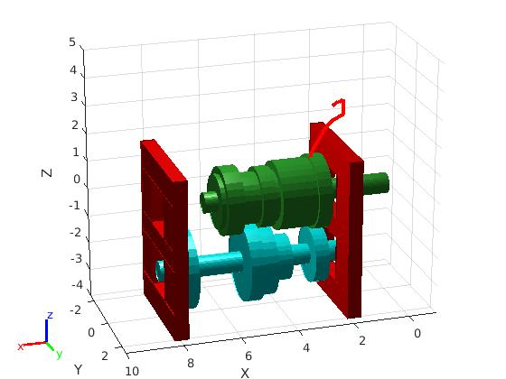
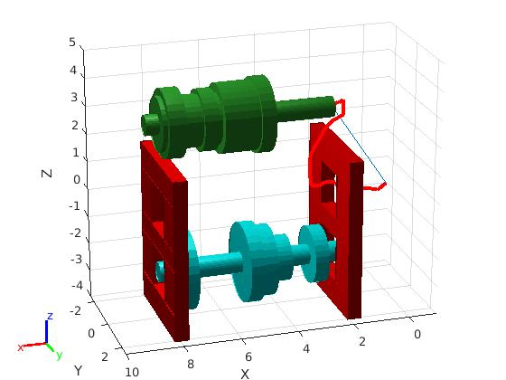
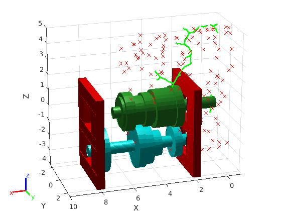

# RBE550 Transmission Assignment

The final homework assignment for RBE550 (Robot Motion Planning), a graduate level course for a WPI Masters in Robotics Engineering. In this assignment, we are given the dimensions for a SM-456 transmission gearbox. This gearbox contains two shafts, and we must utilize RRT path planning to move the top gear out with encountering a collision.